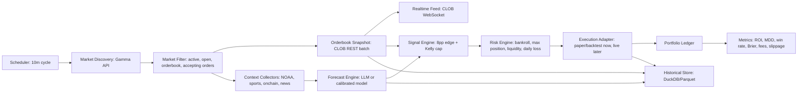

# Polymarket AI 예측시장 트레이딩 봇 개발 아키텍처 및 백테스팅 계획서

작성일: 2026-05-27  
범위: PDF 전략 분석, 개발 아키텍처, 기술 스택, 백테스팅 환경 구성. 실거래 주문 집행 구현과 자산 이동은 제외한다.

## 1. 핵심 결론

- PDF의 핵심 전략은 10분 주기로 500-1000개 활성 시장을 스캔하고, LLM이 산출한 YES 공정가치와 시장 가격의 차이가 8%p 이상이면 진입하며, Kelly Criterion으로 포지션을 산정하되 단일 포지션을 뱅크롤의 6%로 제한하는 구조다.
- PDF에는 명확한 익절/손절/재평가 청산 규칙이 없다. 기본 백테스트는 `hold_to_resolution`을 기본 청산 정책으로 두고, 재평가 청산은 별도 옵션으로만 설계한다.
- 현재 공식 문서 기준 Polymarket은 AMM이 아니라 CLOB 기반이다. 가격은 $0-$1 범위의 결과 토큰 가격이며 확률처럼 해석되지만, 실제 체결가는 midpoint가 아니라 매수 시 ask, 매도 시 bid와 호가 깊이에 의해 결정된다.
- 최적 1차 스택은 Python 3.11+ + `py-clob-client-v2` + `httpx/websockets` + `pandas/polars/duckdb/pyarrow` + 커스텀 이벤트 기반 백테스터다. CCXT는 Polymarket 연동용이 아니라 암호화폐 외부 가격 피드 보조용으로만 둔다.

## 2. 입력 PDF 및 추출 결과

분석한 파일:

- `/Users/gangtaesu/Downloads/drive-download-20260522T213005Z-3-001 2/polymarket_ai_trading_agent_guide.pdf`
- `/Users/gangtaesu/Downloads/drive-download-20260522T213005Z-3-001 2/Polymarket_AI_에이전트_가이드북.pdf`

두 PDF는 같은 주제를 다루지만 완전히 동일한 파일은 아니다. 첫 번째는 13쪽, 두 번째는 15쪽이며 두 번째 문서가 Python/Polymarket 중심의 실행 로직과 리스크 관리 항목을 더 직접적으로 포함한다.

### 2.1 PDF에서 추출한 매매 규칙

| 항목 | PDF 규칙 | 구현 해석 |
|---|---|---|
| 실행 주기 | 10분마다 반복 | scheduler 또는 cron/worker loop |
| 시장 스캔 | 500-1000개 마켓 스캔 | Gamma API `events`/`markets` 페이지네이션, `active=true`, `closed=false`, `enableOrderBook=true`, `acceptingOrders=true` |
| 공정가치 | Claude API로 각 질문의 YES 확률 추정 | `fair_yes_probability`를 0-1 확률로 저장 |
| 진입 조건 | 공정가치와 현재 시장가격의 차이가 8% 이상 | `abs(fair_yes - executable_yes_reference) >= 0.08` |
| 방향 | 공정가치가 가격보다 높으면 YES, 낮으면 NO | YES는 YES ask 기준, NO는 NO ask 기준으로 별도 계산 |
| 포지션 크기 | Kelly Criterion 사용 | `f = (p - price) / (1 - price)` for binary payout, 음수면 0 |
| 포지션 상한 | 최대 뱅크롤 6% | `min(kelly_fraction, 0.06)` |
| 운영 중단 | 잔고가 0이면 에이전트 사망 | 백테스트/라이브 모두 kill switch |
| 데이터 소스 | 날씨 NOAA, 스포츠 부상 리포트, 크립토 온체인/센티먼트 | market category별 collector 인터페이스 |
| 추가 안전장치 | 일일 최대 손실 20%, 동시 포지션 10개, 최소 유동성 $1,000 | PDF의 추가 권장 안전장치로 옵션화 |
| 모니터링 | PnL, API 비용, 카테고리별 성과, Brier Score | metrics 모듈 |

### 2.2 수식

Binary outcome token을 가격 `c`에 매수하면 승리 시 1달러, 패배 시 0달러를 받는다. 순승 배당률은 다음과 같다.

```text
b = (1 - c) / c
kelly = (p * b - (1 - p)) / b
       = (p - c) / (1 - c)
position_fraction = clamp(kelly, 0, 0.06)
```

YES 진입:

```text
p = fair_yes
c = executable_yes_buy_price
edge = p - c
trade if edge >= 0.08
```

NO 진입:

```text
p = 1 - fair_yes
c = executable_no_buy_price
edge = p - c
trade if edge >= 0.08
```

PDF 예시 코드는 `fair_value - YES price`로 방향을 정한 뒤 NO 주문에도 같은 Kelly 입력을 쓰는 형태라 NO 포지션 사이징이 모호하다. 이 설계서는 예측시장 표준 payoff에 맞춰 YES와 NO를 각각 별도 binary asset으로 계산한다.

### 2.3 청산 조건

PDF가 명시한 청산은 다음뿐이다.

- 잔고가 0이면 전체 운영 중단.
- 시장 해결 후 승리 토큰은 $1, 패배 토큰은 $0으로 정산.
- 가격 상승 시 매도해 이익을 확정하거나 손실을 줄일 수 있다고 설명하지만 수치 기준은 없다.

따라서 백테스트 기본값은 `hold_to_resolution`이다. 재평가 청산은 다음처럼 별도 옵션으로 설계하되 기본 전략 성과와 분리한다.

- `exit_on_edge_flip`: 10분 재평가에서 기존 포지션의 edge가 0 이하로 뒤집히면 bid에 청산.
- `exit_on_max_loss`: PDF의 일일 최대 손실 20% 안전장치 발동 시 신규 진입 중지 및 선택적 청산.

## 3. 공식 Polymarket 구조 반영

2026-05-27 공식 문서 및 공개 엔드포인트 기준:

- API는 Gamma, Data, CLOB으로 나뉜다. Gamma는 시장/이벤트 탐색, Data는 포지션/거래/활동, CLOB은 오더북/가격/가격 히스토리/주문 관리를 담당한다.
- Gamma와 Data는 공개 읽기 API이고, CLOB은 공개 시장 데이터 엔드포인트와 인증이 필요한 주문 엔드포인트가 분리된다.
- Polymarket은 CLOB 기반이다. 주문은 오프체인에서 매칭되고 Polygon에서 온체인 정산된다.
- 시장 가격은 결과 토큰의 implied probability로 볼 수 있으나 실제 매수 체결가는 ask, 매도 체결가는 bid다. spread가 넓으면 표시 가격과 체결 가격 괴리가 커진다.
- 각 시장은 YES/NO 결과 토큰을 가지며, 승리 토큰은 resolution 이후 $1, 패배 토큰은 $0으로 redeem된다.
- CLOB orderbook 응답에는 `bids`, `asks`, `min_order_size`, `tick_size`, `neg_risk`, `hash`가 포함된다.
- CLOB 가격 히스토리는 token id 기준으로 조회되며, backtest loader의 1차 historical source가 된다.
- 현재 공식 클라이언트는 `py-clob-client-v2`, `@polymarket/clob-client-v2`, `polymarket_client_sdk_v2`가 문서화되어 있다. 기존 `py-clob-client` 저장소는 2026-05-25에 archive 처리되어 신규 통합에는 사용하지 않는다.

## 4. 목표 아키텍처



### 4.1 컴포넌트 책임

| 컴포넌트 | 책임 | 구현 포인트 |
|---|---|---|
| `market_data.gamma_client` | 이벤트/마켓 탐색 | `events?active=true&closed=false` 우선, 필요 시 `markets` |
| `market_data.clob_client` | orderbook, price, midpoint, spread, price history | batch endpoint와 websocket 병행 |
| `context_collectors` | 시장 카테고리별 외부 데이터 수집 | source timestamp를 반드시 저장해 lookahead bias 방지 |
| `forecasting` | YES 공정가치 산출 | LLM 응답은 확률, 근거, 입력 데이터 타임스탬프를 함께 저장 |
| `strategy` | PDF 전략 이식 | 8%p edge, Kelly, 6% cap, YES/NO 정규화 |
| `risk` | 실행 전 가드 | PDF 권장: daily loss 20%, max positions 10, min liquidity 1000 |
| `execution` | paper/backtest/live 어댑터 | 현재는 backtest/paper only, live order submit 미구현 |
| `backtest` | 이벤트 기반 시뮬레이션 | fill model, fee model, resolution payout, metrics |
| `storage` | raw/normalized/features/trades 저장 | DuckDB catalog + Parquet partitions |

## 5. 기술 스택 제안

### 5.1 추천 스택

| 계층 | 선택 | 근거 |
|---|---|---|
| 언어 | Python 3.11+ | 데이터 처리, LLM, 백테스트, API 통합 생태계가 가장 풍부 |
| Polymarket SDK | `py-clob-client-v2` | 2026-05-27 공식 문서의 현재 Python CLOB 클라이언트 |
| HTTP/WS | `httpx`, `websockets` | Gamma/Data REST와 CLOB websocket 분리 운용 |
| 데이터프레임 | `pandas`, `polars` | pandas는 범용 분석, polars는 대량 가격 히스토리 처리 |
| 저장소 | Parquet + DuckDB | 파일 기반 재현성, 빠른 SQL 분석, 로컬 백테스트에 적합 |
| 모델 API | `anthropic`, `openai` | PDF는 Claude를 기준으로 하고, provider 교체 가능하게 추상화 |
| CLI | `typer`, `rich` | 백테스트 실행, 리포트 출력, 설정 검증 |
| 테스트 | `pytest`, `ruff` | 전략 수식과 백테스트 회귀 검증 |
| 외부 크립토 피드 | `ccxt` optional | Polymarket용이 아니라 crypto category context collector용 |

### 5.2 Generic backtesting library를 쓰지 않는 이유

Backtrader/vectorbt는 주식/선물 시계열에는 편하지만 Polymarket의 핵심인 다시장 binary payoff, YES/NO 토큰, resolution payout, bid/ask depth, `neg_risk` 이벤트를 자연스럽게 표현하기 어렵다. 따라서 1차 버전은 커스텀 이벤트 기반 엔진으로 만들고, 지표 계산에 pandas/polars를 사용한다.

## 6. 백테스팅 환경 설계

### 6.1 디렉토리 구조

```text
.
├── README.md
├── requirements.txt
├── docs/
│   └── polymarket_trading_bot_architecture.md
├── data/
│   ├── mock/
│   │   └── snapshots.csv
│   ├── raw/
│   ├── normalized/
│   └── features/
├── src/
│   └── polymarket_backtest/
│       ├── __init__.py
│       ├── collect_historical.py
│       ├── collectors.py
│       ├── export_dataset.py
│       ├── forecast_providers.py
│       ├── cli.py
│       ├── models.py
│       ├── simulator.py
│       ├── survival.py
│       └── strategy.py
└── tests/
    └── test_strategy.py
```

### 6.2 데이터 스키마

`snapshots.csv` 최소 컬럼:

| 컬럼 | 설명 |
|---|---|
| `timestamp` | snapshot 시각, UTC ISO8601 권장 |
| `market_id` | Polymarket market id 또는 condition id |
| `question` | 시장 질문 |
| `yes_price` | YES token 실행 기준 가격. 실데이터에서는 ask/bid 구분 필요 |
| `no_price` | NO token 실행 기준 가격 |
| `fair_yes` | strategy가 당시 알고 있던 YES 공정가치 |
| `liquidity` | 유동성 |
| `volume_24h` | 24h 거래량 |
| `resolved_outcome` | 미해결이면 빈 값, 해결 시 `YES` 또는 `NO` |
| `fee_rate` | taker fee rate. 모의 데이터에서는 category별 단순 값 |

실제 historical ingestion은 다음 순서로 구성한다.

1. Gamma API로 `active=false/closed=true` 또는 특정 slug/event의 market metadata 수집.
2. `clobTokenIds`를 파싱해 YES/NO token id를 정규화.
3. CLOB `prices-history`로 token별 price series 수집.
4. 가능하면 orderbook snapshots 또는 best bid/ask를 별도 저장해 slippage model 개선.
5. resolution outcome과 close time을 Gamma/UMA 데이터에서 병합.
6. LLM forecast는 당시 시점에서 사용 가능한 외부 데이터만 사용해 별도 feature table에 저장.

현재 MVP collector는 최근 resolved binary `["Yes", "No"]` 마켓만 수집하고, `negRisk=true` 및 non-YES/NO 스포츠 O/U/승자 시장은 제외한다. 생성되는 `snapshots_neutral.csv`는 `fair_yes`를 당시 YES 가격과 동일하게 둔 중립 데이터셋이므로 수익률 검증이 아니라 ingestion/settlement/backtest plumbing 검증용이다.

### 6.3 체결 및 비용 모델

백테스트 fill model은 단계적으로 강화한다.

| 버전 | 모델 | 목적 |
|---|---|---|
| V0 | snapshot price + fixed slippage bps | 빠른 전략 수식 검증 |
| V1 | best bid/ask 구분 | midpoint 착시 제거 |
| V2 | orderbook depth walk | 주문 크기별 체결 평균가 계산 |
| V3 | FOK/FAK/GTD 시뮬레이션 | live execution과 일치도 개선 |

수수료는 공식 taker fee 공식을 적용한다.

```text
fee = shares * fee_rate * price * (1 - price)
```

Maker 주문은 수수료 0으로 두되, 미체결/부분체결 확률을 별도 모델링해야 한다.

### 6.4 성과 지표

- Total return / ROI
- CAGR은 시장 기간이 짧고 이벤트별 만기가 달라 기본 지표에서 제외하고 옵션화
- Max Drawdown (MDD)
- Win rate: 청산된 포지션 기준
- Average trade PnL, payoff ratio
- Exposure: 현금 대비 포지션 가치, 카테고리별 집중도
- Brier Score: forecast calibration
- Fee and slippage drag
- API cost ratio: LLM/API 비용이 gross profit에서 차지하는 비율

## 7. 단계별 개발 로드맵

### Phase 0 - 정책/안전 경계

- 실거래 기능을 `execution/live_*`로 분리하고 기본 import 경로에서 제외.
- `.env`에는 키 이름만 문서화하고 private key 예시는 절대 커밋하지 않음.
- 사용자 위치/접근 가능 국가, Polymarket 약관, 세금/법률 검토 필요성을 운영 체크리스트에 표시.

### Phase 1 - PDF 전략 백테스트 MVP

- `kelly_fraction`, `build_signal` 단위 테스트.
- mock snapshot loader와 event-driven simulator 구현.
- `hold_to_resolution` 기본 청산으로 ROI, MDD, win rate 산출.
- fee/slippage parameter를 CLI로 노출.

### Phase 2 - Historical Data Ingestion

- Gamma `markets/events` collector 구현.
- `clobTokenIds`, `outcomePrices`, `orderMinSize`, `orderPriceMinTickSize`, `feesEnabled`, `feeType` 정규화.
- CLOB `prices-history` collector 구현.
- Parquet partition: `data/raw/polymarket/{source}/dt=YYYY-MM-DD/`.
- DuckDB view: `markets`, `tokens`, `price_history`, `resolutions`.

### Phase 3 - Forecast/Context Replay

- `ForecastProvider` 인터페이스: `MockForecastProvider`, `LLMForecastProvider`, `RecordedForecastProvider`.
- weather/sports/crypto/news collector를 category별 plugin으로 분리.
- lookahead 방지를 위해 모든 context row에 `observed_at`, `source_published_at`, `ingested_at` 저장.
- LLM forecast JSON schema: probability, reasoning summary, evidence timestamps, model, cost.

### Phase 4 - Execution-Aware Backtest

- YES/NO ask/bid 구분.
- orderbook depth 기반 average fill price 계산.
- `min_order_size`, `tick_size`, `feesEnabled`, `fee_rate` 반영.
- maker vs taker simulation, GTD 만료, partial fill ledger 구현.

### Phase 5 - Paper Trading

- CLOB websocket으로 실시간 best bid/ask 업데이트.
- 실주문 대신 paper order ledger에 체결 가정 기록.
- live market latency, missed fill, stale book, API throttling 지표 수집.
- kill switch: stale data, websocket disconnect, daily loss, API error burst.

### Phase 6 - Live Trading Readiness Review

- 별도 승인 전까지 실거래 submit 비활성.
- private key 보관, allowance, funder/proxy wallet, geo restriction, 세무/법률 검토 체크리스트 완료.
- 소액 canary order는 이 문서 범위 밖이며 별도 승인 필요.

## 8. 기술 병목 및 리스크 보고

| 리스크 | 영향 | 대응 |
|---|---|---|
| PDF의 과거 수익 사례 재현 불가능 | 과최적화/기대수익 과장 | 실데이터 백테스트와 forward paper trading으로 분리 검증 |
| 명확한 청산 규칙 부재 | 성과 지표가 exit policy에 민감 | 기본은 hold-to-resolution, 재평가 청산은 별도 시나리오 |
| LLM forecast lookahead bias | 백테스트 과대평가 | context timestamp 저장, 과거 시점 재현만 사용 |
| midpoint와 체결가 괴리 | 실제 수익률 악화 | ask/bid/depth 기반 fill model, max slippage guard |
| 얇은 유동성/넓은 spread | edge 소멸 | PDF의 min liquidity 옵션, orderbook depth walk |
| API rate limit/throttle | scanner 지연, stale signal | batch endpoint, websocket, local cache, backoff |
| SDK 변경 | 유지보수 부담 | v2 SDK wrapper를 내부 adapter로 감싸기 |
| `py-clob-client` archive | 문서/PDF 예시와 현재 구현 불일치 | 신규 구현은 `py-clob-client-v2` 기준 |
| 지리적 제한 | 거래 불가/약관 위반 위험 | 공식 제한 국가 확인, VPN 우회 금지 |
| fee-enabled markets | edge 8%가 실제로는 부족할 수 있음 | fee-adjusted edge를 별도 리포팅. 기본 진입 조건은 PDF대로 유지 |
| negative risk/multi-outcome | YES/NO 단순 보완 관계 깨질 수 있음 | `neg_risk` market은 별도 모델 전까지 제외 또는 별도 엔진 |
| LLM 전수 평가 비용 | 10분마다 500-1000개 마켓을 모두 LLM 호출하면 비용/시간 병목 발생 | PDF의 스캔 범위는 유지하되 LLM 호출 전 공개 메타데이터, PDF-listed 유동성 조건, spread/depth 실행 가능성으로 후보를 압축 |
| Kelly overconfidence | LLM 확률이 calibration되지 않으면 6% cap도 공격적일 수 있음 | 기본은 PDF cap을 보존하고, 리포팅에서 fractional Kelly 시나리오를 별도 비교 |

## 9. Antigravity 리뷰 반영 메모

워크스페이스 규칙에 따라 민감정보 없는 요약만 Antigravity에 1회 리뷰시켰다.

- 실행: `agy -p ... --print-timeout 3m --log-file /tmp/agy-polymarket-review.log`
- 결과: exit status 0, 약 48초, log path `/tmp/agy-polymarket-review.log`
- 관찰 모델: `Gemini 3.5 Flash (Medium)`
- Codex 검증 후 반영한 지적:
  - LLM 전수 호출은 비용/latency 병목이므로 사전 후보 압축이 필요하다.
  - lookahead bias 통제가 backtest 설계의 핵심이다.
  - Kelly는 LLM 확률 calibration에 민감하므로 fractional Kelly 시나리오를 별도 비교해야 한다.
  - orderbook depth, fee rate, 중도 청산 시나리오 검증이 후속 과제다.
  - maker rebate와 fee rate 세부값은 공식 fee 문서로 재확인했다.

## 10. 공식 출처 확인 메모

- Polymarket 공식 API 문서는 Gamma/Data/CLOB 세 API와 CLOB 인증 분리를 명시한다.
- 공식 market data 문서는 market/event 모델, `outcomes`와 `outcomePrices`의 1:1 매핑, `enableOrderBook`을 명시한다.
- 공식 orderbook 문서는 orderbook public endpoint, bid/ask, tick size, min order size, price history, websocket market channel을 명시한다.
- 공식 fees 문서는 taker fee 공식 `fee = C * feeRate * p * (1 - p)`와 category별 fee rate를 명시한다.
- 공식 restrictions/help 문서는 미국을 제한 국가로 표시하고 VPN 우회를 금지한다. 사용자의 실제 물리적 위치와 적용 플랫폼을 별도 확인해야 한다.

참고 링크:

- Polymarket API Introduction: https://docs.polymarket.com/api-reference/introduction
- Polymarket Clients & SDKs: https://docs.polymarket.com/api-reference/clients-sdks
- Market Data Overview: https://docs.polymarket.com/market-data/overview
- Fetching Markets: https://docs.polymarket.com/market-data/fetching-markets
- Prices & Orderbook: https://docs.polymarket.com/concepts/prices-orderbook
- Trading Orderbook: https://docs.polymarket.com/trading/orderbook
- Trading Fees: https://docs.polymarket.com/trading/fees
- Positions & Tokens: https://docs.polymarket.com/concepts/positions-tokens
- Resolution: https://docs.polymarket.com/concepts/resolution
- Geographic Restrictions: https://help.polymarket.com/en/articles/13364163-geographic-restrictions

## 11. 로컬 검증 기록

- PDF 텍스트 추출: `pdftotext -layout`로 두 문서 모두 추출 가능함을 확인.
- PDF 렌더링 점검: `pdftoppm`으로 한국어 가이드 1-2쪽을 PNG 렌더링하고 표지 가독성을 확인.
- 공식 API smoke check:
  - `https://gamma-api.polymarket.com/markets?active=true&closed=false&enableOrderBook=true&order=volume_24hr&ascending=false&limit=2`에서 활성 orderbook 마켓 샘플 수신.
  - `https://clob.polymarket.com/ok` 응답 `"OK"` 확인.
  - `https://clob.polymarket.com/prices-history?...`에서 token price history 수신 확인.
- PyPI 확인: `py-clob-client-v2` 최신 사용 가능 버전 `1.0.1` 확인.

이 문서는 투자 조언이 아니며, 전략 구현과 검증을 위한 기술 설계 문서다.
